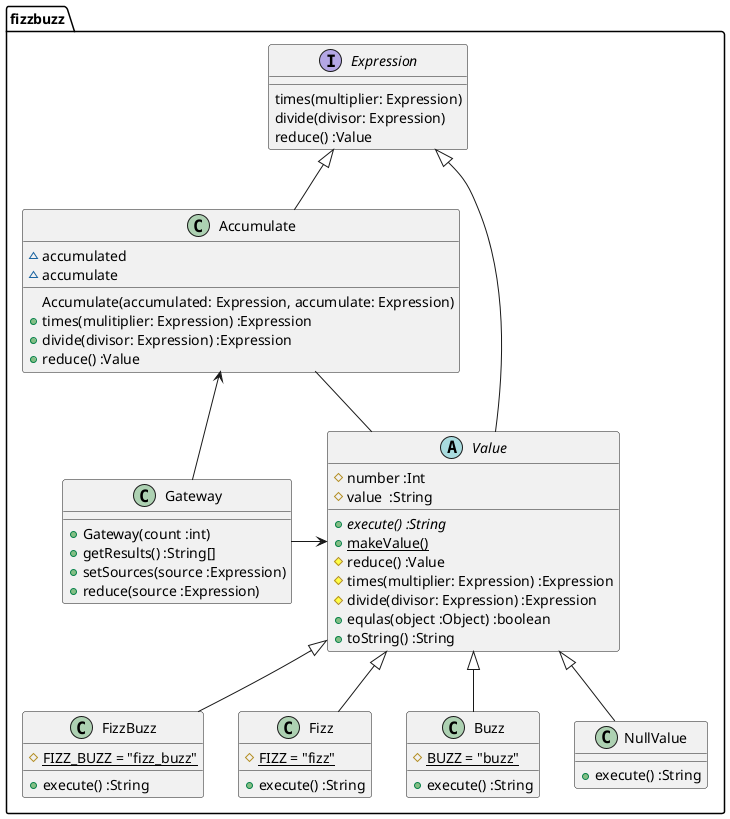
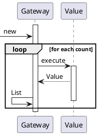
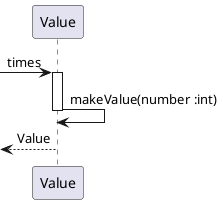
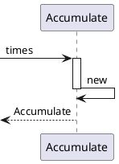
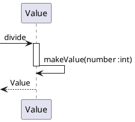
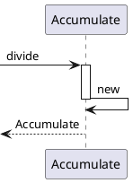
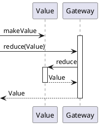
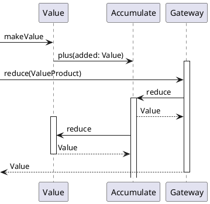

---
markdown:
  image_dir: ../assets
  path: ../fizzbuzz.md
  ignore_from_front_matter: true
  absolute_image_path: false
---

# FizzBuzz
## 仕様
+ ３で割り切れる場合は「Fizz」を出力する。
+ ５で割り切れる場合は「Buzz」を出力する。
+ 両者で割り切れる場合は「FizzBuzz」を出力する。
+ 上記以外の場合は与えられた数値を出力する。
+ 指定された回数だけ繰り返し実行する。

## 設計
### TODO
+ [x] ~~クラスを定義する~~
+ [x] ~~３で割り切れる場合のテストを作成する~~
+ [x] ~~５で割り切れる場合のテストを作成する~~
+ [x] ~~両者で割り切れる場合のテストを作成する~~
+ [x] ~~条件を満たさない場合のテストを作成する~~
+ [x] ~~指定された回数だけ繰り返し実行する場合のテストを作成する~~
+ [x] ~~出力された値を全て保持する~~
+ [x] ~~必要なものだけを公開するようにする~~
+ [x] ~~繰り返し実行する部分を分離する~~
+ [x] ~~新しい条件を追加しやすくする~~
+ [x] ~~オブジェクトを返すようにする~~
+ [x] ~~オブジェクトを演算できるようにする~~
  + [x] $FizzBuzz = {Fizz}\times{Buzz}$
  + [x] $Buzz = \frac{FizzBuzz}{Fizz}$
  + [x] $Fizz = \frac{FizzBuzz}{Buzz}$
+ [x] ~~equals()~~
+ [x] ~~集積の概念を表すオブジェクトを追加して構造をシンプルにする~~
+ [x] ~~仕上げのリファクタリング~~

### クラス図

### シーケンス図
#### #Gateway

#### #times

#### #divide

#### #reduce

## 実装
### ふりかえり
+ 実行クラスをインスタンスに変更する
+ 結果を配列からコレクションに変更する
+ コレクションの学習テストを実施する
+ reduceメソッドのカプセル化
+ 不適切なメソッド名称の整理
+ クラスの名称を変更
+ パッケージの導入

### `FizzBuzzTest.java`
@import "../../src/test/java/tdd/fizzbuzz/FizzBuzzTest.java"
### `Value.java`
@import "../../src/main/java/tdd/fizzbuzz/Value.java"
### `FizzBuzz.java`
@import "../../src/main/java/tdd/fizzbuzz/FizzBuzz.java"
### `Fizz.java`
@import "../../src/main/java/tdd/fizzbuzz/Fizz.java"
### `Buzz.java`
@import "../../src/main/java/tdd/fizzbuzz/Buzz.java"
### `NullValue.java`
@import "../../src/main/java/tdd/fizzbuzz/NullValue.java"
### `Gateway.java`
@import "../../src/main/java/tdd/fizzbuzz/Gateway.java"
### `Expression.java`
@import "../../src/main/java/tdd/fizzbuzz/Expression.java"
### `Accumulate.java`
@import "../../src/main/java/tdd/fizzbuzz/Accumulate.java"

