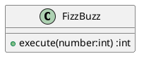

---
markdown:
  image_dir: ../assets
  path: ../fizzbuzz.md
  ignore_from_front_matter: true
  absolute_image_path: false
---

# FizzBuzz
## 仕様
+ ３で割り切れる場合は「Fizz」を出力する。
+ ５で割り切れる場合は「Buzz」を出力する。
+ 両者で割り切れる場合は「FizzBuzz」を出力する。

## 設計
### TODO
+ [x] ~~クラスを定義する~~
+ [x] ~~３で割り切れる場合のテストを作成する~~
+ [x] ~~５で割り切れる場合のテストを作成する~~
+ [x] ~~両者で割り切れる場合のテストを作成する~~

### ふりかえり
+ クラスを設計して実装した
+ 最初に失敗するテストを作成してメソッドを実装した
+ 仕様を満たす１つのテストがパスするまでは次の仕様に着手しなかった

### クラス図

## 実装

### `FizzBuzzTest.java`
@import "../../src/test/java/tdd/fizzbuzz/FizzBuzzTest.java"
### `FizzBuzz.java`
@import "../../src/main/java/tdd/fizzbuzz/FizzBuzz.java"

