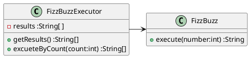
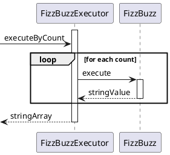

---
markdown:
  image_dir: ../assets
  path: ../fizzbuzz.md
  ignore_from_front_matter: true
  absolute_image_path: false
---

# FizzBuzz
## 仕様
+ ３で割り切れる場合は「Fizz」を出力する。
+ ５で割り切れる場合は「Buzz」を出力する。
+ 両者で割り切れる場合は「FizzBuzz」を出力する。
+ 上記以外の場合は与えられた数値を出力する。
+ 指定された回数だけ繰り返し実行する。

## 設計
### TODO
+ [x] ~~クラスを定義する~~
+ [x] ~~３で割り切れる場合のテストを作成する~~
+ [x] ~~５で割り切れる場合のテストを作成する~~
+ [x] ~~両者で割り切れる場合のテストを作成する~~
+ [x] ~~条件を満たさない場合のテストを作成する~~
+ [x] ~~指定された回数だけ繰り返し実行する場合のテストを作成する~~
+ [x] ~~出力された値を全て保持する~~
+ [x] ~~必要なものだけを公開するようにする~~
+ [x] ~~繰り返し実行する部分を分離する~~

### クラス図

### シーケンス図

## 実装
### ふりかえり
+ 単一責任の原則(SRP)に従って設計を変更した
+ リファクタリング（クラスの抽出）を実施して繰り返し実行するクラスを新規に作成した
+ 抽出したクラスに対してリファクタリング（フィールドの移動とメソッドの移動）を実施してテストが壊れていないことを確認した

### `FizzBuzzTest.java`
@import "../../src/test/java/tdd/fizzbuzz/FizzBuzzTest.java"
### `FizzBuzz.java`
@import "../../src/main/java/tdd/fizzbuzz/FizzBuzz.java"
### `FizzBuzzExecutor.java`
@import "../../src/main/java/tdd/fizzbuzz/FizzBuzzExecutor.java"

