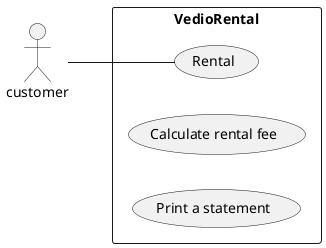
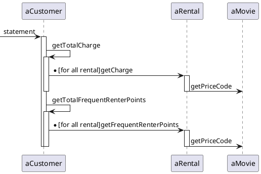

---
markdown:
  image_dir: ../assets
  path: ../refactoring.md
  ignore_from_front_matter: true
  absolute_image_path: false
---

# リファクタリング

## 要求
顧客が借りたビデオのレンタル料金を計算して計算書を印刷する。


## 仕様
+ ビデオレンタルの料金を計算して計算書を印刷するプログラム
+ システムにはどの映画を何日間借りるかが入力される。
+ 貸出の日数によって料金が計算され、映画の分類が判定される。
+ 映画の分類は３つある。一般向け、子供向け、新作。
+ レンタルポイントも印刷される。新作かどうかによってポイント計算の仕方が異なる。

## 設計
### TODO
+ [x] ~~一般向けビデオのレンタルテスト作成~~
+ [x] ~~子供向けビデオのレンタルテスト作成~~
+ [x] ~~新作ビデオのレンタルテスト作成~~
+ [x] ~~statementメソッドの分割、再配置~~
+ [x] ~~amountForメソッドの移動~~
+ [x] ~~レンタルポイント計算部分の抽出~~
+ [x] ~~一時変数の削除~~
+ [ ] **料金計算の条件文をポリモーフィズムに置き換える**
+ [ ] 最後は継承で

### クラス図
```puml
class NewReleasePrice {
    getCHarge()
}
class ChildrensPrice {
    getCharge()
}
class RegularPrice {
    getCharge()
}
class Price {
    getCharge()
}
class Movie {
  priceCode:int
  getFrequentRenterPoints(days: int)
  getCharge()
}
class Rental {
  daysRented:int
  getCharge()
  getFrequentRenterPoints()
}
class Customer {
  statement()
  htmlStatement()
  getTotalCharge()
  getTotalFrequentRenterPoints()
}
Price <|-- NewReleasePrice
Price <|-- ChildrensPrice
Price <|-- RegularPrice
Price "1"<- Movie
Movie "1"<- Rental
Rental "*"<- Customer
```

### シーケンス図
statement(計算書生成)メソッドのシーケンス図

## 実装
### `CustomerTest.java`
@import "../../src/test/java/refactoring/videorental/CustomerTest.java"
### `Movie.java`
@import "../../src/main/java/refactoring/videorental/Movie.java"
### `Price.java`
@import "../../src/main/java/refactoring/videorental/Price.java"
### `ChildrensPrice.java`
@import "../../src/main/java/refactoring/videorental/ChildrensPrice.java"
### `NewReleasePrice.java`
@import "../../src/main/java/refactoring/videorental/NewReleasePrice.java"
### `RegularPrice.java`
@import "../../src/main/java/refactoring/videorental/RegularPrice.java"
### `Rental.java`
@import "../../src/main/java/refactoring/videorental/Rental.java"
### `Customer.java`
@import "../../src/main/java/refactoring/videorental/Customer.java"
