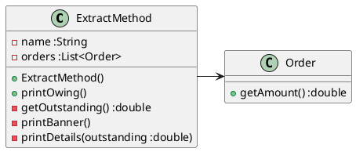
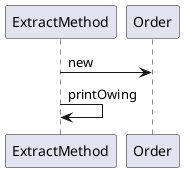

---
markdown:
  image_dir: ../assets/refactoring_catalog
  path: ../refactoring_catalog.md
  ignore_from_front_matter: true
  absolute_image_path: false
---

# リファクタリングカタログ

## メソッドの構成
### メソッドの抽出
#### 設計
##### クラス図

##### シーケンス図

#### 実装
`ExtractMethodTest.java`
@import "../../src/test/java/refactoring/catalog/ExtractMethodTest.java"
`ExtractMethod.java`
@import "../../src/main/java/refactoring/catalog/ExtractMethod.java"

## オブジェクト間での特性の移動
## データの再編成
## 条件記述の単純化
## メソッド呼び出しの単純化
## 継承の取り扱い
## 大きなリファクタリング
